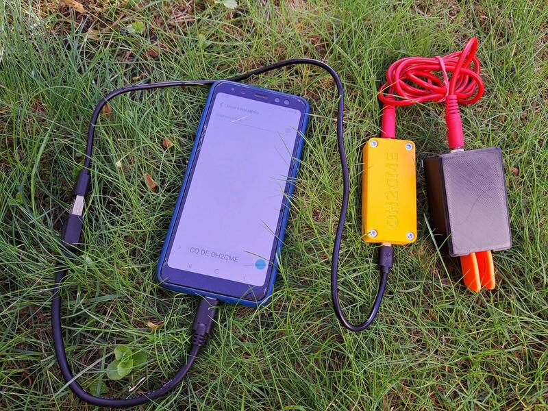

# OH2CME Microkeyer

Microkeyer is an pocket sized [Morse code](https://en.wikipedia.org/wiki/Morse_code) keyer based on 
the Arduino Pro Micro board. Use it to transform any iambic paddle key into a USB input device for phones
and computers.

## Bill of materials

- Arduino Pro Micro (physical size 17,9 mm x 33 mm)
- 4 x M3 brass threaded inserts
- 4 x M3 x 5 mm hex socket cap screws
- 2 x 10 kΩ resistors
- Piezo buzzer
- 3,5 mm stereo jack (barrell shape, diameter 8 mm)
- 3D printed enclosure (see provided STL file)

## Wiring

* Connect buzzer to pin 14 and ground.
* Connect stereo jack tip and middle connector to pins 6 and 7 with pull-op resistors.
* Connect stere jack sleeve to ground.
 

